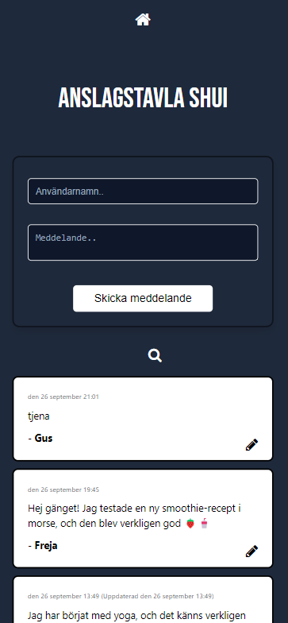
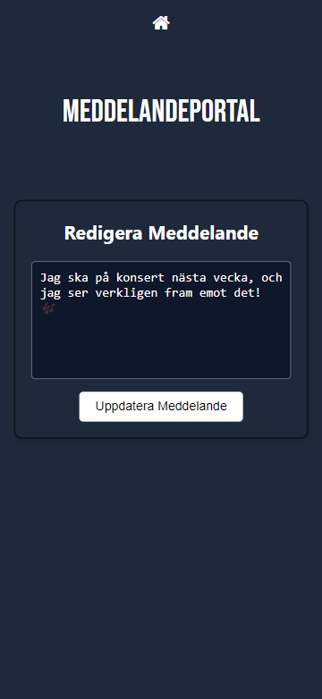

# 🎯 Individuell Examination - Anslagstavla Shui

## 📝 Projektbeskrivning
Detta projekt är en enkel anslagstavla där användare kan:
- Se alla meddelanden.
- Se meddelande från specifik användare.
- Posta nya meddelanden.
- Uppdatera ett befintligt meddelanden.

Projektet består av en frontend byggd i React med Vite och en serverless backend via AWS Lambda, API Gateway och DynamoDB.

## 🌐 Länk till Webbapplikationen
Anslagstavlan kan nås här: [Anslagstavla Shui](http://min-anlagstavla-shui.s3-website.eu-north-1.amazonaws.com/)

## 🛠️ Teknologier som används
- **Frontend**: React med Vite, hostad på AWS S3.
- **Backend**: AWS Lambda, API Gateway, DynamoDB.
- **Serverless Framework**: Använt för att deploya Lambda-funktioner och konfigurera API Gateway.

## 📋 Instruktioner:
➡️ **Ladda ner zip-filen eller gör en fork av repot.** 

➡️ **Öppna projektmappen i din terminal.** 

➡️ **Installera nödvändiga beroenden genom att köra följande kommando:**

```
npm install

```

➡️ **Deploya backend genom att navigera till mappen med serverless-funktionerna och köra följande kommando:**

```
serverless deploy

```

➡️ **Använd den unika endpoint-URL som returneras efter deploy för att göra API-anrop.**

➡️ **Öppna din webbläsare och navigera till http://min-anlagstavla-shui.s3-website.eu-north-1.amazonaws.com/ för att använda applikationen.**

## 📚 API Endpoints

### 1. GET /messages
**Beskrivning**: Hämtar alla meddelanden.  
**Endpoint**: [GET /messages]
**URL**: `https://8ml8eg55tl.execute-api.eu-north-1.amazonaws.com/dev/messages`  
**Response**:

```
{
    "createdAt": "2023-09-25T12:34:56Z",
    "text": "This is a message",
    "username": "exampleUser",
    "id": "123"
}
```
### 2. GET /messages?username={username}
**Beskrivning**: Hämtar meddelanden för en specifik användare.  
**Endpoint**: [GET /messages/by-username?username={username}]  
**URL**: `https://8ml8eg55tl.execute-api.eu-north-1.amazonaws.com/dev/messages/by-username?username=Hugo`  
**Response**:  

```
{
		"createdAt": "2024-09-26T21:14:43.753Z",
		"username": "Hugo",
		"text": "Jag och min hund gick på en lång promenad i parken i helgen. Det var så härligt att se alla höstfärger! 🍂🐶",
		"id": "fd3fc0ab-df56-48ee-b0fb-88475821df6b"
	}
```
### 3. POST /messages
**Beskrivning**: Posta nya meddelanden.  
**Endpoint**: [POST /messages]  
**URL**: `https://8ml8eg55tl.execute-api.eu-north-1.amazonaws.com/dev/messages`  
**Request body (exempel)**:  

```
{
  "username": "Hugo",
  "text": "Jag och min hund gick på en lång promenad i parken i helgen. Det var så härligt att se alla höstfärger! 🍂🐶"
}
```
**Response**:

```
{
	"message": "Message created"
}
```

### 4. PUT /messages/{id}
**Beskrivning**: Uppdaterar ett befintligt meddelande.  
**Endpoint**: [PUT /messages/{id}]  
**URL**: `https://8ml8eg55tl.execute-api.eu-north-1.amazonaws.com/dev/messages/fd3fc0ab-df56-48ee-b0fb-88475821df6b`   
**Request body (exempel)**:  

```
{
  "content": "Jag och min hund gick på en lång promenad i parken i helgen. Det var så härligt att se alla höstfärger! 🍂🐶 Sen började det regna på oss, så vi sprang hem! ☔️😂"
}
```

**Response**:

```
{
	"message": "Message updated",
	"updatedValues": {
		"content": "Jag och min hund gick på en lång promenad i parken i helgen. Det var så härligt att se alla höstfärger! 🍂🐶 Sen började det regna på oss, så vi sprang hem! ☔️😂",
		"updatedAt": "2024-09-26T21:47:42.167Z"
	}
}
```

<div align="center">
    
    
</div>


